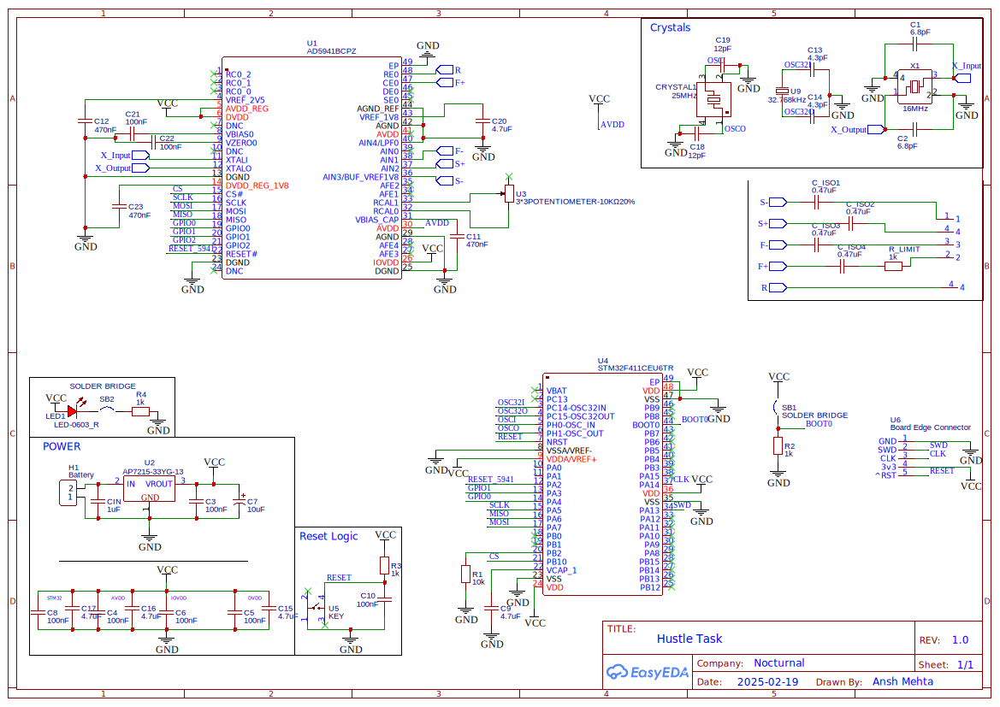
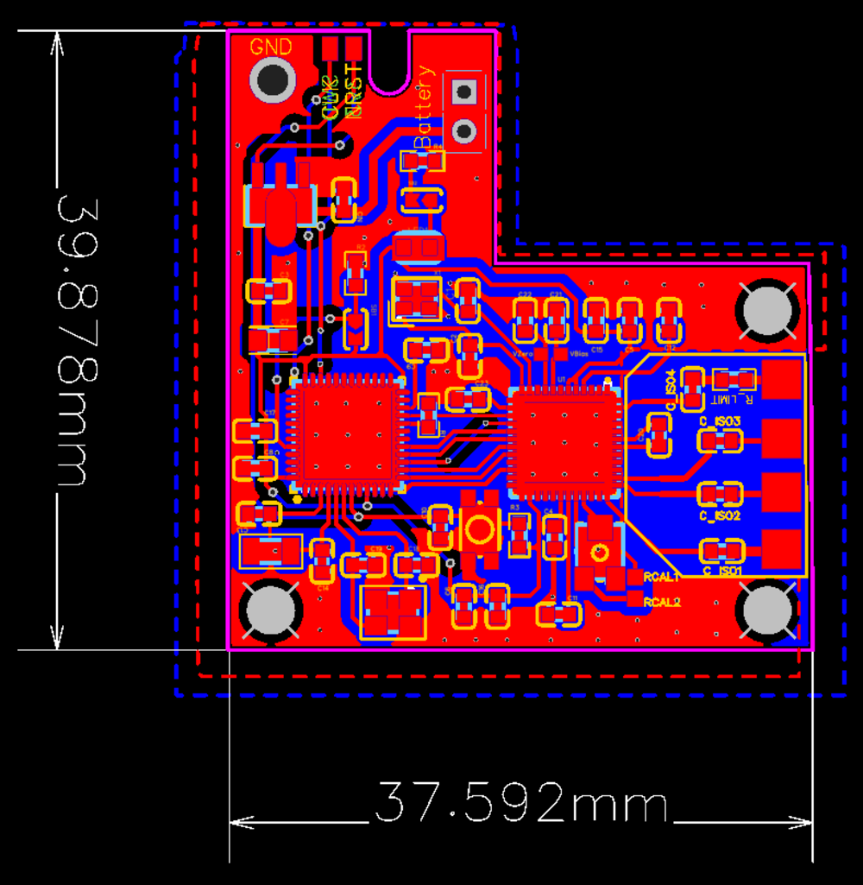

**Choice of Components:**

1. **AD5941**: Selected due to its rich features, including onboard DFT, programmable switch matrix, calibration features, and a larger frequency output range, making it well-suited for impedance measurement applications.
2. **AP7215**: Used to supply 3.3V to the circuit. It was chosen for its low quiescent current, with a no-load current of 55μA compared to the 5mA current consumed by the AMS1117, making it ideal for wearable applications.
3. **External Crystals**: Not explicitly required for the impedance measurement module. A single crystal for the STM32 would have sufficed. However, due to the firmware development taking longer than anticipated, no final decision was made in time.
4. **STM32F411CEU6**: Selected because it allowed readily available hardware testing, ensuring that the firmware for the MCU’s peripherals and configurations worked as expected.
5. **Solder Bridges for LED and Boot**: A solder bridge is used to disconnect the power LED to reduce idle power draw in case of battery operation. Another solder bridge is used on the BOOT0 pin to select the boot location for the program on the STM32.
6. **Edge Connector**: Used to program the STM32 using SWD.
7. **1mm Square Pads**: Since the exact electrode connectors were unknown at the time of design, 1mm square pads were used as placeholders for flexibility in later modifications.
8. **Battery Slot**: A dedicated slot for a Li-ion battery is provided. A 100mAh battery can easily fit in this slot. A battery charging circuit was considered but was not implemented due to time constraints.
9. **Wearable PCB Form Factor**: The PCB has been designed to be wearable, with a compact 4cm × 4cm footprint, including space for the battery.

---

**Circuit Design:**

### Schematic

### Board Layout

---
## Battery Life Estimation

Using the formula:

\[ \text{Battery Life} = \frac{\text{Battery Capacity (mAh)}}{\text{Current Consumption (mA)}} \]

### Case 1: Active Measurement Mode (~40mA)
\[ \frac{100mAh}{40mA} = 2.5 \text{ hours} \]
If the system continuously measures impedance, the battery would last approximately **2.5 hours**.

### Case 2: Mixed Usage (Active + Idle)
\[ \frac{40 + 5}{2} = 22.5mA \]
\[ \frac{100mAh}{22.5mA} \approx 4.4 \text{ hours} \]
Estimated runtime: **~4.4 hours**.

### Case 3: Mostly Idle Mode (~5mA)
\[ \frac{100mAh}{5mA} = 20 \text{ hours} \]
If the device spends most of its time in low-power mode, the battery could last up to **20 hours**.

A battery charging circuit would be included, but within the time constraints presented, implementing that would have been difficult.

---

**Switching Technique:**
The **SWCON (Switch Control) Register** configures the switch matrix inside the AD5941, allowing:
- Routing of excitation signals (via **CE0**)
- Selection of differential voltage measurement pairs (**AIN1, AIN2, AIN3**)
- Defining the current return path

| Measurement Pair | Excitation (CE0) | Positive Input (V+) | Negative Input (V-) | Return Path |
|-----------------|----------------|-------------------|-------------------|-------------|
| Pair 1         | CE0            | AIN1             | AIN2             | AIN3        |
| Pair 2         | CE0            | AIN1             | AIN3             | AIN2        |
| Pair 3         | CE0            | AIN2             | AIN3             | AIN1        |

**Switch Configuration for Calibration:**

| Excitation | V+ Input | V- Input | Return Path |
|-----------|---------|---------|-------------|
| CE0       | RCAL+   | RCAL-   | AIN3        |

---

**Test Methodology:**

**Communication Verification:**
Before running impedance measurements:
1. Read a known register (**0x0404**) to check if the AD5941 responds.
2. Expected value: **0x5502**.
3. If successful, continue testing.
4. If failed, debug SPI or power connections.

**Calibration with RCAL:**
RCAL is a known reference resistor (e.g., **1kΩ**). Measuring it allows computation of correction factors.

**Procedure:**
1. Switch to **RCAL mode**.
2. Measure impedance at **1 kHz**.
3. Compute **gain factor** and **phase offset**.
4. Store correction values.

- If **RCAL = 1kΩ**, impedance should read close to **1000Ω, 0° phase**.
- If not, apply **software gain correction**.

---

**Impedance Measurement Accuracy:**

**Procedure:**
- Connect known test impedances (**500Ω, 1kΩ, 10kΩ**) between electrode pairs.
- Measure each impedance across frequencies:
  - **100 Hz, 500 Hz, 1 kHz, 5 kHz, 10 kHz, 20 kHz, 50 kHz**
- Compare results with expected values.

**Expected Output:**

| Frequency | Expected Magnitude | Expected Phase |
|-----------|-------------------|---------------|
| 100 Hz    | 1000 Ω           | ~0°          |
| 1 kHz     | 1000 Ω           | ~0°          |
| 10 kHz    | 1000 Ω           | ~0°          |
| 50 kHz    | 1000 Ω           | Small phase shift |

---

**Validation with a Human Body:**
After verifying with known resistors:
1. Attach electrodes to the body.
2. Measure bioimpedance at multiple sites.
3. Check expected **phase shift** due to **tissue capacitance**.

---

**Design and Development Process:**
- Initially, the AD5941 provided libraries were considered, but difficulties in dynamically switching electrodes led to implementing a **custom driver**.
- This approach required **thorough datasheet review**, enhancing understanding of the chip’s functionality.
- Ideally, the **sequencer and FIFO buffer** would have been implemented along with **interrupts for low-power operation**.
- A **USB interface** was considered but not implemented due to time constraints.
- The first board revision lacked programming access; an **SWD edge connector** was later added.
- The design conforms to **IEC 60601** standards, ensuring that no more than **10μA of DC current** enters the human body.

